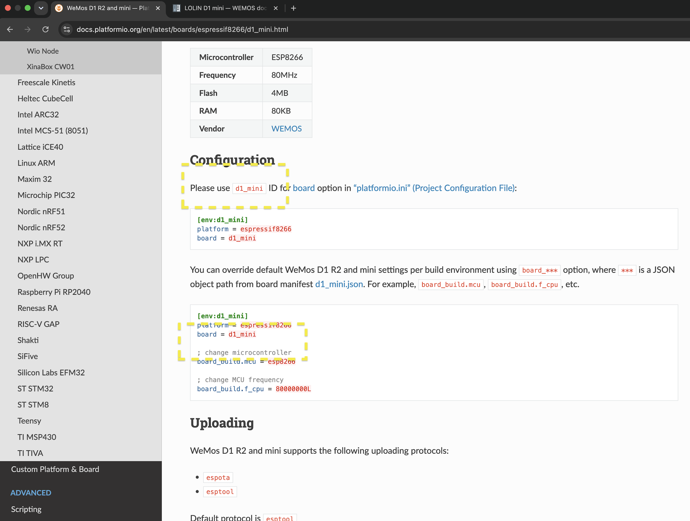
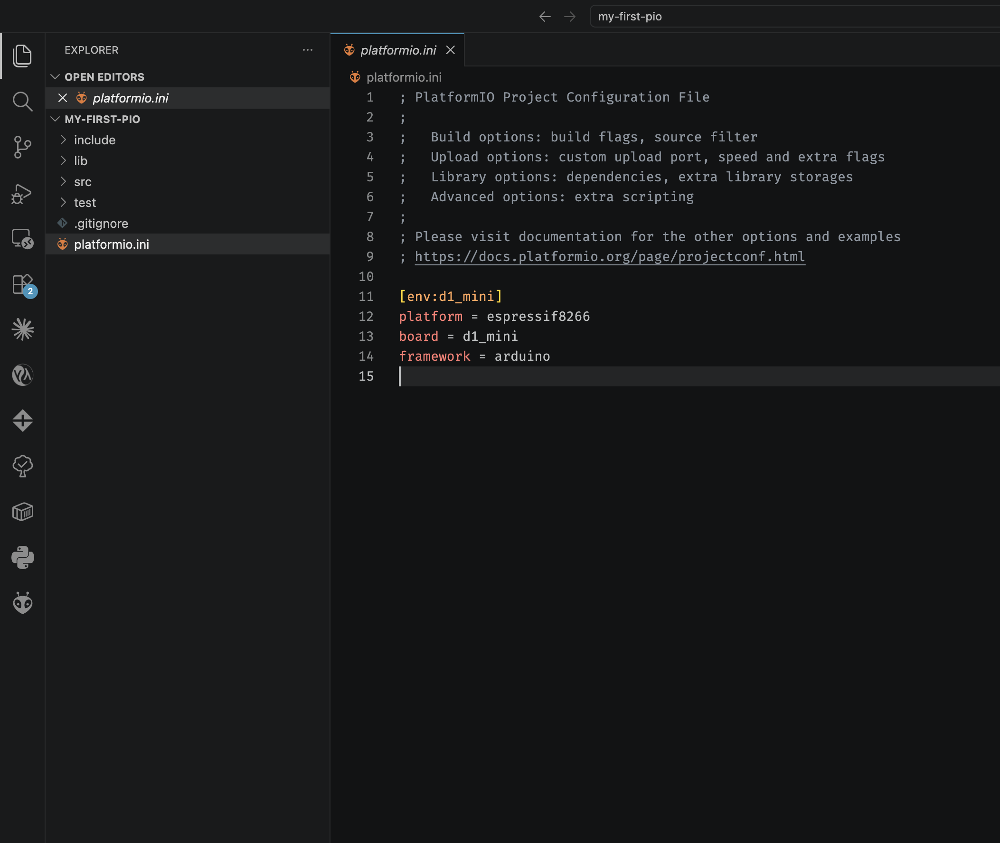

# Internet-of-Things (IoT)

Prerequisites
--
- [x] PlatformIO [Installation]
(https://github.com/lackdaz/linux-sidequests/tree/main/ide/vscode%2Bplatformio)
- [x] [LOLIN D1 Mini V4](https://www.aliexpress.com/item/32529101036.html?spm=a2g0o.order_list.order_list_main.67.67921802NWXxqf) - SGD$6.06
- [x] USB-C cable interface (requires data)

## Background

The platform of choice for the iot microcontrollers will be the espressif boards - also known as ESP. The platform itself is storied by itself for not only being the most cost-effective system-on-chip (SoC) solution out there for the past 10 years, but also for his humble beginnings as a WiFi peripheral add-on to the powerful-yet-WiFi-less Arduino platform boards, like the UNO, MEGA.

Espressif was also started by a Singaporean - a huge pride factor.

To pay homage to that history, the board we chose for this class is the original ESP8266 WEMOS D1 mini (now LOLIN V4) - a 12-year old design that is outdated but still relevant by today's standards.

The ESP32 (released in 2016) should be by-far the best-in-class (BiC) platform of choice. However, there are incompatibilities at the hardware peripheral level (pin mappings, GPIO numbers, hardware-specific libraries like SoftwareSerial, AVR-specific registers), meaning code written originally for Arduino boards might not be fully interopable (re-usable) with the ESP32. The older ESP8266 platform does not suffer from this same issue.

The classic journeyman learning journey would start off with the original Arduino boards (UNO, MEGA), then moving on to the WiFi ESP8266 boards and finally the ESP32, with its expanded SoC features, like pulse counters, quiscent deep-sleep etc. This will be the journey we will be opting for.

## Know your board (LOLIN D1 Mini)

Before I typically start any hardware project, I would google up two things:
- pin mappings for the board of choice
- the platformio entry for the board

Let's start by googling pin mappings for the D1 Mini (renamed LOLIN), remember to hit images so you can do board comparisons. The board layout has changed across the versions, with the SOC chip itself sometimes facing downwards, and a Pro version featuring a U.FL(IPEX) connector for an external antenna. There are also many cheaper versions by other vendors. There is a whole jungle of competing ESP8266 "carrier boards" out there. Let's go with the official version from wemos.cc (the original manufacturers):


What we would like to look for is this:
> Note: sometimes the boards come shipped with a little cardboard layout card with this exact diagram.


Looking at the diagram above, note in order of importance:
1. The 3.3V power (also know as 3v3), that will typically power your 3v3 peripherals, sensors, etc.
1. The 5V line (known here as VBUS). USB supplies 5V in mirrored configuration to power the serial chip - typically a CH340C (C-variant has an internal oscillator). See if you can spot this lovely peripheral on the board layout! This 5V will power sensors/peripherals that require 5V.
1. Ground (seen here as GND).
1. Data pin (SDA)
1. Clock pin (SCL)
1. Analog pin (A0) - the D1 mini only has one ADC pin.

Now let's talk about 'gotchas'. A gotcha is something uninformative and buried deep within documentation. It's like something you wish someone told you from the get-go so you do not waste hours of your time trying to solve it.

The big gotcha about the ESP8266 platform are the 'strapping pins'. Some pins have to be LOW/HIGH during the flash/boot/reset sequence so any attempt to use them would cause a lot of unintended consequences.

| Pin | Boot requirement |
|-----|-----------------|
| GPIO15 (D8) | Must be LOW |
| GPIO0 (D3) | LOW = flash mode, HIGH = normal boot |
| GPIO2 (D4) | Must be HIGH |


> TDLR: just avoid wiring these 3 pins to anything

Now referring to the second thing we have to do - read up the platformio entry for the D1 mini. I linked the reference below for convenience but this is something you should learn to google too.

source: <https://docs.platformio.org/en/latest/boards/espressif8266/d1_mini.html>

Look up for the identifier that platformio has given the board, also called the board definition. In this case it is the `d1_mini` and it's worth remembering this if you use this board alot:



Sometimes the documentation gives you useful tips on how to toggle different board settings, like the clock frequency. Higher clock frequencies usually consume more power, which would not be a problem if you are running wired. Reading the platformio documentation is very rewarding because it gets you up to scratch with using the features of the SoC without having to learn the entire upload tooling kit.

## Fire up your first`pio` project

Assuming you have `pio` core installed already (Refer to prerequisites). Create a directory for the code to live and then create the platformio project
```
cd ~
mkdir -p code/my-first-pio
cd code/my-first-pio
pio init -b d1_mini
code .
```

## Understanding the platformio.ini config file

A visual code window should spawn after some time with the following IDE. Navigate to the `platformio.ini` because this is where the magic is going to happen for a lot of `pio` features:



Let's add some very useful features:
```ini
[platformio]
default_envs = d1_mini

[env]

[env:d1_mini]
platform = espressif8266
board = d1_mini
framework = arduino
upload_speed = 460800
monitor_speed = 9600
```

## Environments